# 行列式

## 排序、逆序、逆序数

奇数次**相邻**对换改变排列的奇偶性

偶数次**相邻**对换不改变

对换改变排列的奇偶性

## 行列式的性质

转置

**推论：若某一行元素全为0，则D = 0**

(提取出的 k = 0)

对换位置 	D = - D  ==> D = 0

★用得最多

能让某行相加后 = 0

例题：

=======================================================================================

=======================================================================================

D = (-1)^3 D  ==>	D = -D    ==>  D = 0

=======================================================================================

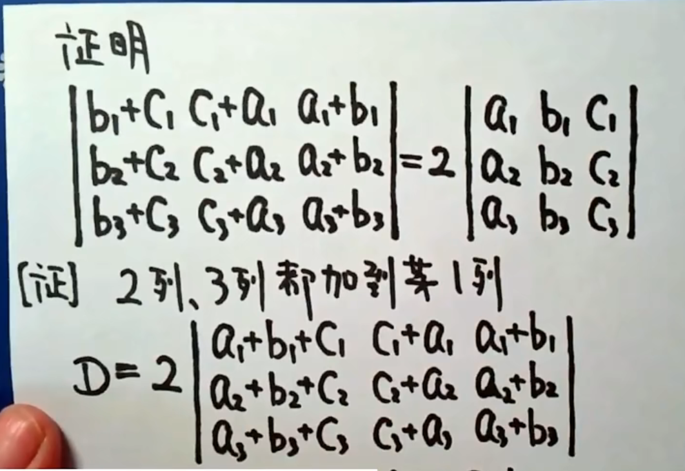

方法二：拆开成八个行列式，两列相同的等于0

=======================================================================================

=======================================================================================

## 按行(列)展开公式

### 代数余子式

去掉第i行，去掉第j列

定理1

定理2

=======================================================================================

### 范德蒙德行列式

### 拉普拉斯展开式

=======================================================================================

例题：

想办法用范德蒙德==》把第四行变成全部1==》第一行加到第四行

=======================================================================================

方法二：

拉普拉斯

对换行列式两行(列)位置，行列式变号

=======================================================================================

方法二

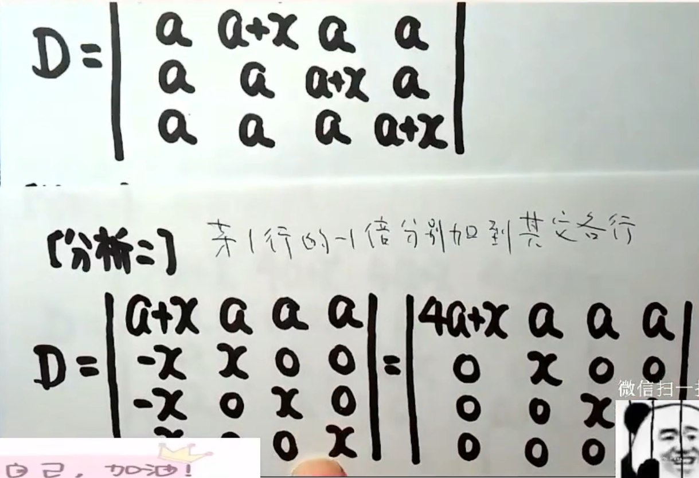

=======================================================================================

(-1)^(m+n)		m为a的阶数，n为b的阶数

## 克拉默法则

 

**把第j列换成常数项**

=======================================================================================

### 推论

# 矩阵及其运算

## 运算法则

=======================================================================================

## 转置

=======================================================================================

=======================================================================================

## 方阵行列式

=======================================================================================

## 伴随矩阵

## 可逆矩阵

**二阶矩阵的逆矩阵**

先求伴随矩阵

​	主对角线互换

​	副对角线变号

再求伴随矩阵前面的系数

​	主对角线积减去副对角线积的倒数

### 性质

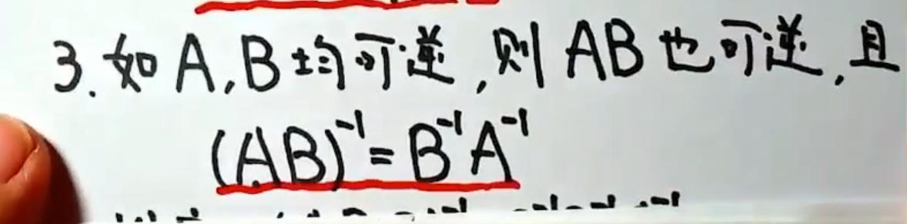

A可逆  <==>  |A| != 0

=======================================================================================

=======================================================================================

**二阶矩阵的伴随矩阵：主对角线互换，副对角线变号**

=======================================================================================

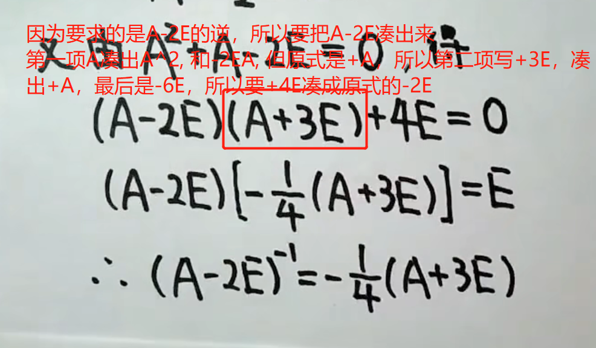

## 对角矩阵

=======================================================================================

## 练习

伴随与逆转换

**|A*|  =  |A|^(n-1)**

=======================================================================================

(2)

=======================================================================================

因为行列式内有减号不好计算，想办法去掉减号

**把伴随换成逆**

方法二：

**逆换成伴随**

=======================================================================================

=======================================================================================

## 分块矩阵

十字分块，按行分块，按列分块

分块矩阵的运算

设A, B分别是m阶，n阶

=======================================================================================

=======================================================================================

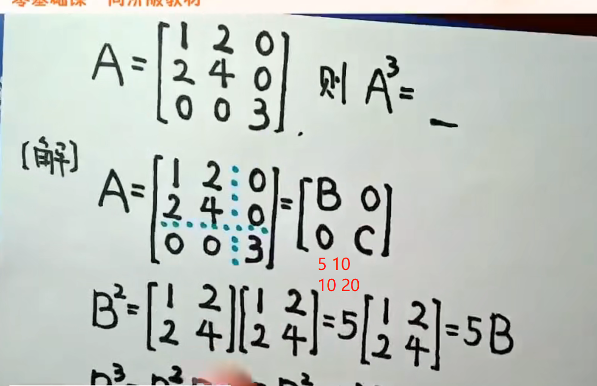

======================================================================================

=======================================================================================

=======================================================================================

# 矩阵的初等变换

## 初等矩阵

=======================================================================================

**左乘**一个初等矩阵的结果 ==> 对矩阵进行同样的**行**初等变换

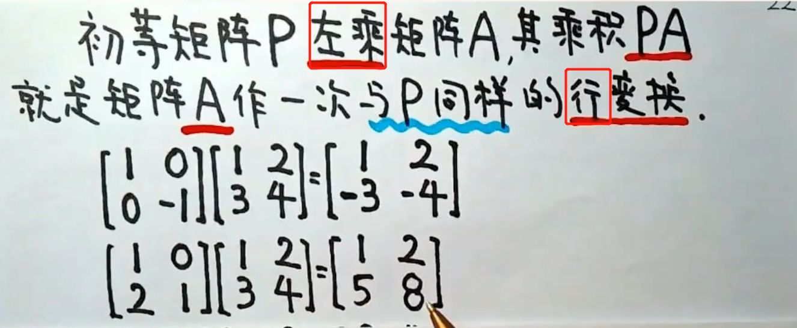

**右乘**一个初等矩阵的结果 ==> 对矩阵进行同样的**列**初等变换

=======================================================================================

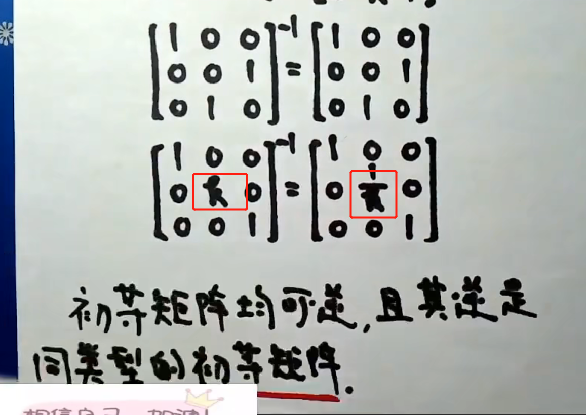

## 行阶梯矩阵

如果有零行，要在底部，没有就不用

1 2 3 4

0 5 6 7

0 0 8 9

0 0 0 0

## 行最简矩阵

## 初等行变换求逆矩阵

**A可逆   <==>	A可以表示为若干个初等矩阵的乘积**

求逆矩阵

=======================================================================================

AX = B, 求X

===

=======================================================================================

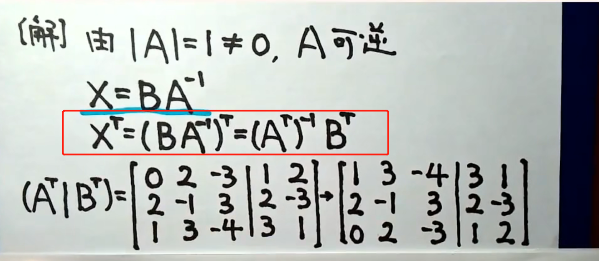

# 矩阵的秩（重点）

 

定理

**经初等变换矩阵的秩不变**

推论

## 秩的性质

# 向量组的线性相关性

=======================================================================================

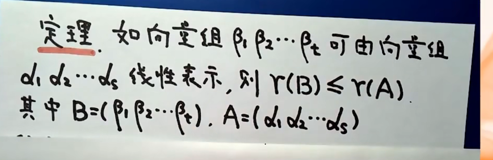

由r(A) = r(B) = r(A,B)

得 向量组 α1α2 和 β1β2β3等价

=======================================================================================

## 线性相关

​	

=======================================================================================

### 推论

α1，α2，α3线性无关的充要条件是任意一个三维向量都能被它们线性表出

**克拉默法则**

**线性相关两种方法**

1. r < m

2. 系数行列式为0

**r <= n < n+1**

=======================================================================================

k1,k2,k3...不全为零，可以将添加得 αt 系数等于0，最后线性相关仍然成立

=======================================================================================

=======================================================================================

=======================================================================================

=======================================================================================

=======================================================================================

=======================================================================================

=======================================================================================

# 向量组的秩

## 极大线性无关组

## 定理

=======================================================================================

=======================================================================================

**A的列向量线性相关  <==> B的列向量线性相关**

=======================================================================================

## 练习

研究β的关系，等价于α的关系

β1，β2，β4线性无关

r = 3

## 三秩相等

=======================================================================================

(Ⅰ)：α1 α2...

(Ⅱ)：β1 β2...

# 线性方程组有解判定

## 齐次方程组

### ★

=======================================================================================

=======================================================================================

### 练习

倍加时，|A|=|B|

倍乘时，|A|!= |B|

互换时，|A| = -|B|

### 基础解系

复习全书p241

=======================================================================================

a=1时

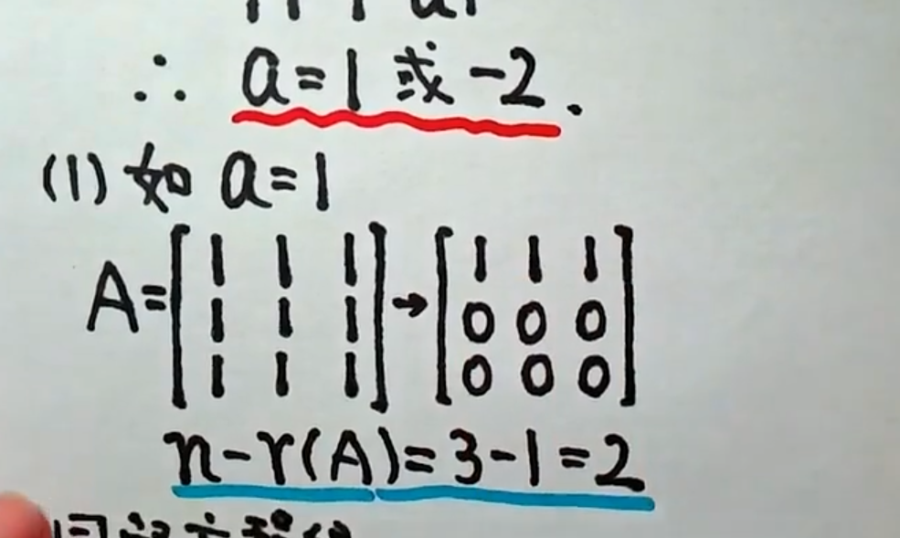

a=2时

## 非齐次方程组

### 有解判定

### 解的结构

=======================================================================================

### 练习

**别把1/2带进去**

=======================================================================================

=======================================================================================

**A不是n阶矩阵，不能用可逆**

======================================================================================

=======================================================================================

Ⅱ

=======================================================================================

# 向量空间

不成立的

=======================================================================================

=======================================================================================

验证基

1. 线性无关
2. 空间内任意向量β可由α1...线性表出

=======================================================================================

==============

=======================================================================================

# 向量内积

线性相关时

=======================================================================================

## 定理

=======================================================================================

## 施密特正交化

=======================================================================================

分母放外面，分子放进去

# 正交矩阵

=======================================================================================

## 规范正交基

# 特征值与特征向量

======================================================================================

分别求特征向量

## 定理

=======================================================================================

 

·

=======================================================================================

**α，β是分别属于不同特征值的特征向量**

**==>  α 与 β 的线性组合不是a的特征向量**

## 已知A的特征值，求A-E的....

正推

不能反推

=======================================================================================

=======================================================================================

=======================================================================================

# 相似矩阵

## 性质

**AT ~ BT**

**AB ~ BA**

**若 A ~ B**

## 相似对角化

 

推出下面的定理

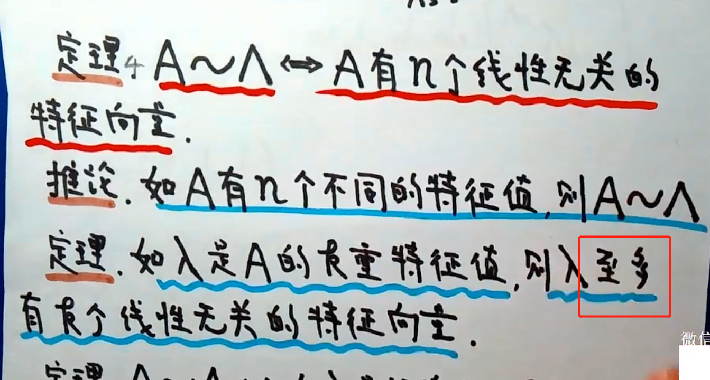

=======================================================================================

然后求特征向量

# 实对称矩阵

α2T α1 = 0

=======================================================================================

=======================================================================================

=======================================================================================

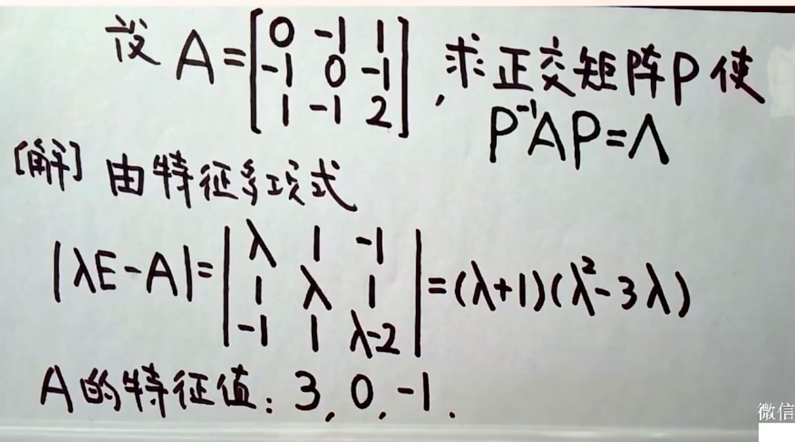

特征值不同，特征向量已经正交，只需要单位化

# 二次型

**平方项系数 ==> 主对角线上**

**混合项系数 / 2 ==> 分别在对角线两侧**

**6.坐标变换**

C要可逆

以x为自变量的函数 ==> 以y为自变量的函数

采取不同的坐标变换

变成不同的二次型

====

**B与A合同**

=======================================================================================

## 合同

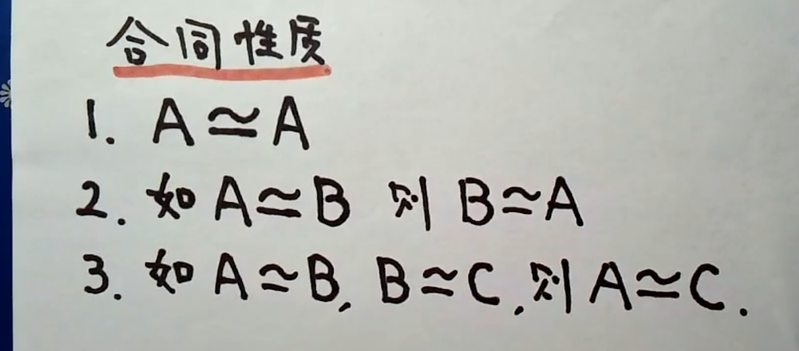

## 标准型

y3 = x3是自己加上去的，让行列式不等于0

没看懂右边的x

x1 = y1 - y2

x2 = y2 - y3

x3 = y3

=======================================================================================

没有平方项，令x1=y1+y2, x2=y1-y2, x1x2组成平方项

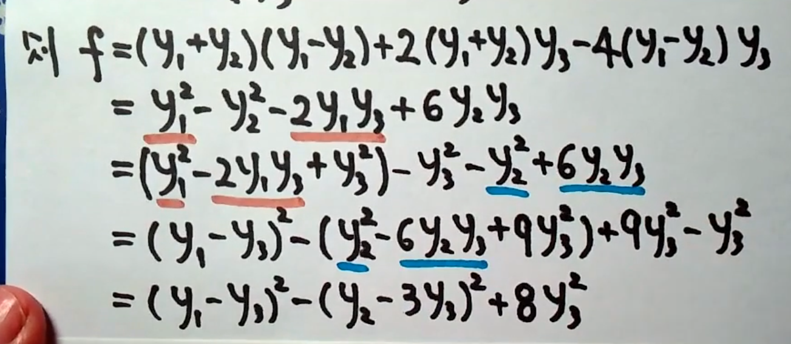

## 正交变换化二次型为标准型

=======================================================================================

## 化为规范型

二次型 ==> 标准型 ==> 规范型

经过两次坐标变换

## 惯性定理

推出

## 合同的充要条件

====

## 正定二次型

=======================================================================================

=======================================================================================

正定的充要条件

正定的必要条件

还有	|A| > 0

=======================================================================================

顺序主子式全大于0 => f 是正定二次型

**解法二：**

全部特征值大于0

**解法三：**

配方法

p = 3,  q = 0

=======================================================================================

(1) 二阶顺序主子式  <  0

=======================================================================================

=======================================================================================

# 练习

方法二：

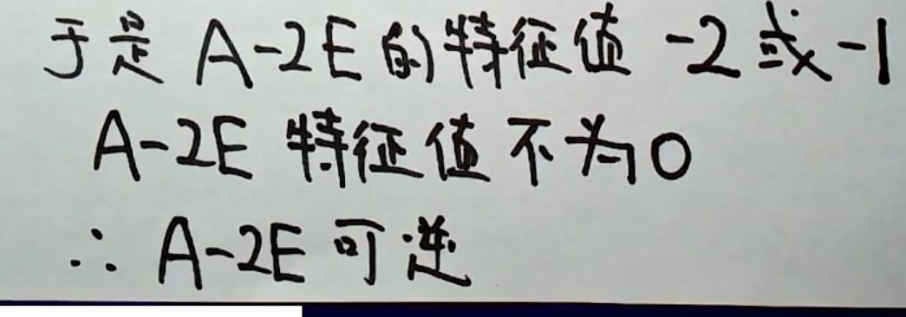

=======================================================================================

=======================================================================================

还要证明 Bα != 0

=======================================================================================

(1)

特征值是   -2, -2, 0

(2)

=======================================================================================

因为r(A) = 2  ==>  r(f) = 2

=======================================================================================

# 补充

可交换交矩阵

AB = BA