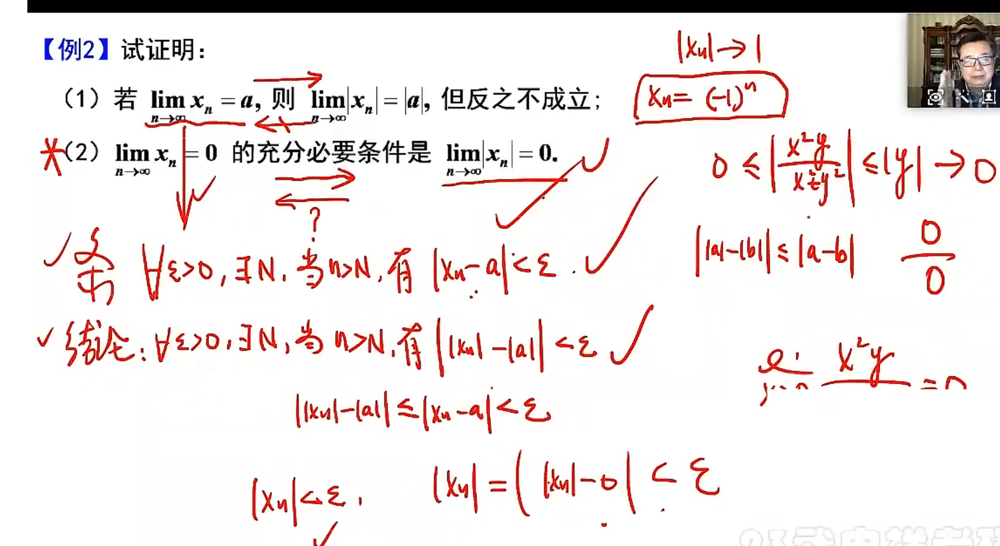
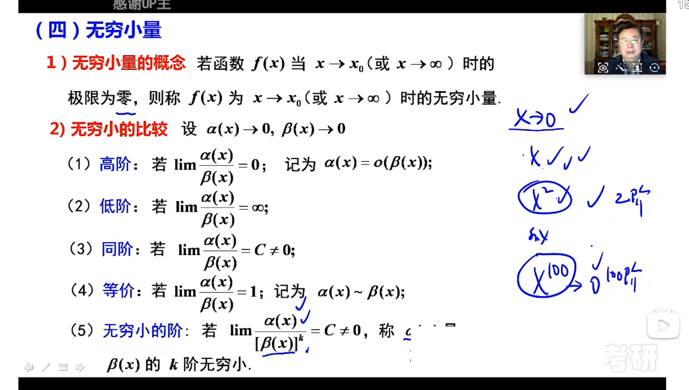
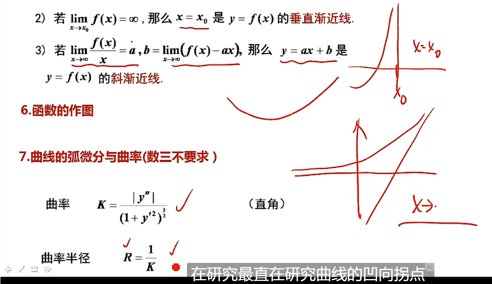
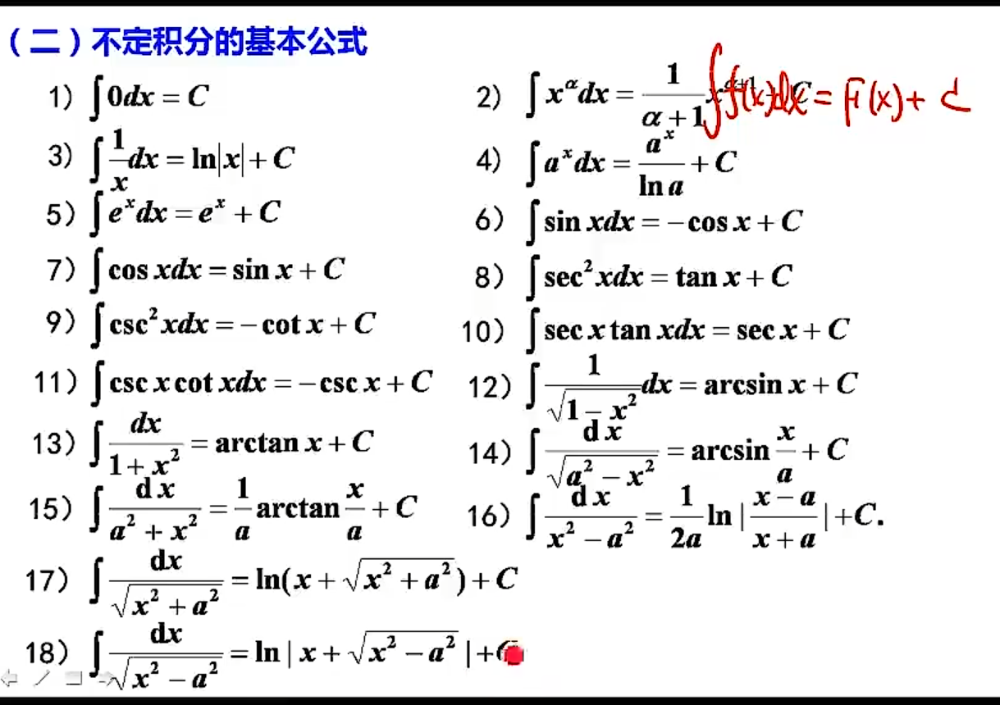
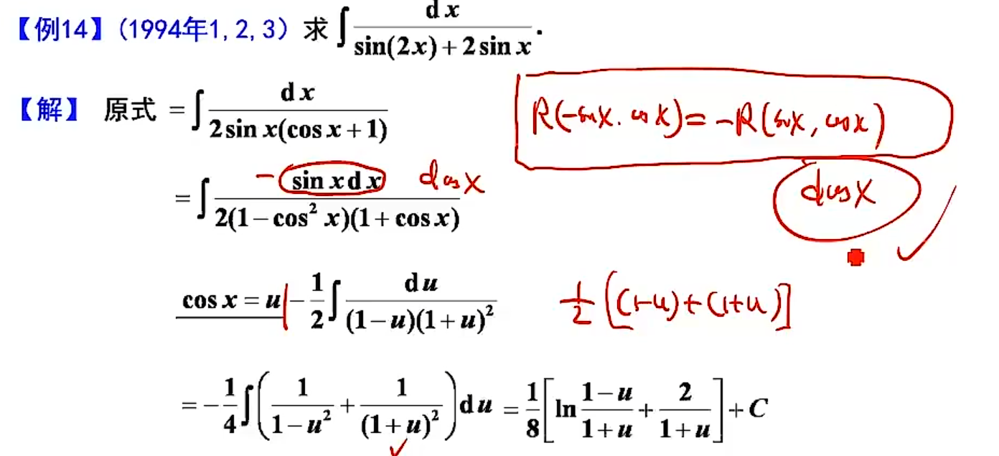
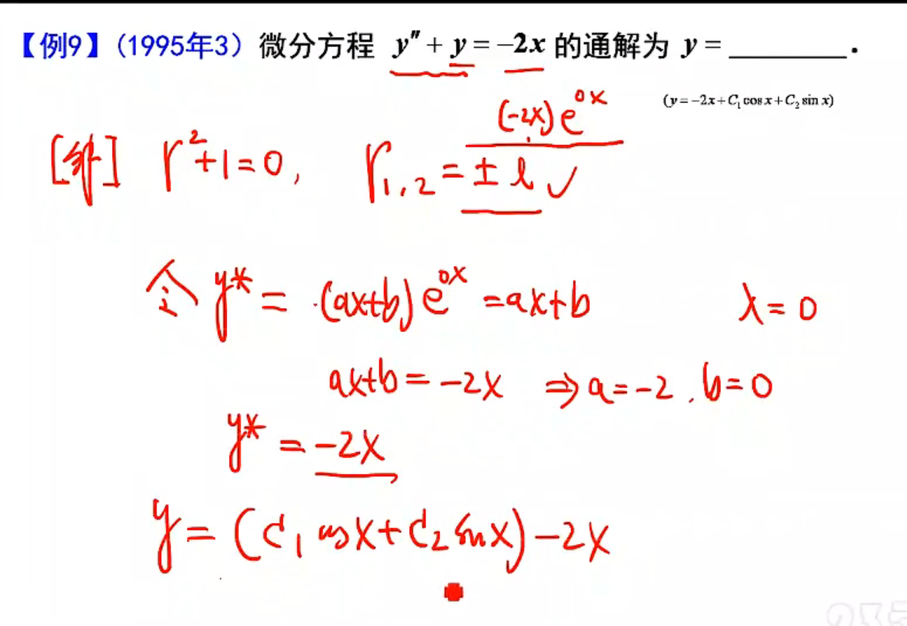
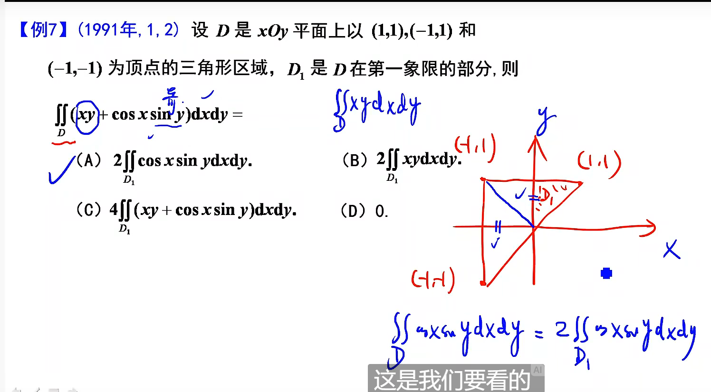

#  高等数学

# 第一章 函数 极限 连续

## 第一节 函数

## 第二节 极限

注意 **e** 和 **arctan** 型极限分正负

### 夹逼

**放缩**

**x-1 < [x] <= x**

单调有界

趋近于0 -> 无穷小

趋近于正无穷/负无穷 -> 无穷大

### 求极限

#### 基本极限

		

 	

#### 等价无穷小

	

 

#### 有理运算法则

**计算的时候把存在的放一起，不存在的放一起**

**总体存在，一半正无穷，另一半就是0**

	

#### 洛必达

**f(x) n 阶可导，用洛必达最多到 n-1 阶**

**f(x) n 阶连续可导，用洛必达最多到 n 阶**

#### 泰勒公式

 

####  夹逼

#### 单调有界准则

#### 利用定积分定义

提取 1/n 出来，容易看出里面的函数是什么

通过观察变量确定定义域

该题也能用夹逼（复杂）

用到了右上角的基本不等式

=====================================================================

**右上角公式** 	cos

## 间断点

## 连续性

# 第二章 导数

## 微分

## 导数公式

隐函数求导：对方程两边求导

**参数方程求导**

**对数求导**

## 高阶导数

## 结论使用

# 第三章 微分中值定理及导数应用

可能取得极值的点

1. 驻点：导数 = 0；
2. 导数不存在的点

## 曲线凹凸性

拐点：二阶导等于0，三阶导存在

## 渐近线

======

**零点那里还要验证函数在零点连续**

斜渐近线：y = f(x) = ax + b + α(x)， α(x) 趋近于0

即  一次函数加一个极小，这里只有 C 符合

蓝色部分同上

ln(1+ex) 提取 ex，转化为 x + 无穷小

**注意**：求水平渐近线时，e无穷不一定是无穷，注意负无穷时趋近于0

**方程的根**

存在性：零点定理

个数：单调性

罗尔定理

将等于零的这串函数当作f'(x)，原函数为f(x)

## 不等式的证明

拉格朗日中值定理

第一项奇函数×奇函数为偶函数

f(x) 为偶函数，只用证明一半

f(0) = 0，然后看单调性

注意: 

sinx < x < tanx

## 中值定理证明题

罗尔定理

拉格朗日

# 第四章 不定积分

第一类间断点

没有原函数

第二类间断点

可能有原函数

 

## 凑微分

## 第二类换元法

​	

## 分部积分法

## 有理函数积分

(x-1)^2: 一次二重，所以下面的分母有（x-1）和（x-1）^2 两项，分子为次数-1，所以为A和B

(x^2+x+1): 二次一重，所以分母只有一项，分子为一次

## 三角有理式积分

## 简单无理函数积分

 

# 第五章 定积分和反常积分

## 定积分

	

## 反常积分

### 判断敛散性

1. 定义
2. 比较判别法
3. p积分

### 反常积分计算

1.换元

2.分部

# 第六章 定积分的应用

# 第七章 常微分方程

常系数非齐次线性微分方程

待定系数法

y*代入微分方程中

====================

定积分证明题还没做

常微分方程应用题要再看

# 第八章 多元函数微分学

## 极限

## 偏导数

## 全微分

证明

x偏导数 > 0, 函数沿x轴方向递增

y偏导数 < 0, 函数沿y轴方向递减

## 多元函数微分法

### 复合函数微分法

### 隐函数微分法

## 多元函数的极值和最值

================================================

# 第九章 二重积分 

根号x^2+y^  =>   到原点距离   =>  (0, Π/2)

==========================================

# 微分算子法求特解

